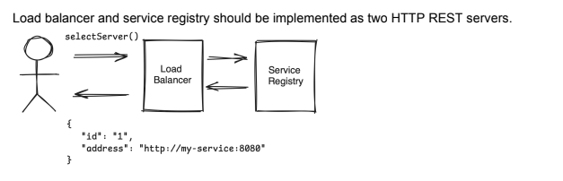

### Load Balancer

Implementation of a load-balancer which uses service registry.

### Interfaces:
#### interface LoadBalancer: 
func selectServer(): Server

### interface ServiceRegistry:

func registerServer(server: Server): Boolean

func deregisterServer(server: Server): Boolean

func getServers(): List<Server>

#### Server model:

class Server(val id: String, val address: String)
Load balancer and service registry should be implemented as two HTTP REST servers.

### Requirements:
1. Implement the ServiceRegistry and LoadBalancer interfaces. The load-balancer should
   have two flavors of balancing algorithm: One is round-robin and the other is random
   selection.
2. Prepare a demo with curl / postman / other http tool to demonstrate the flow.

### Tests with curl

**Create server:**

`curl -X POST http://localhost:8080/service-registry/register      -H "Content-Type: application/json"      -d '{"id": 2, "address": "12.3.45"}'
`

**Request server from loadbalancer:**

`curl -X GET "http://localhost:8080/load-balancer/select/server?strategy=round-robin" -H "Accept: application/json"
`
